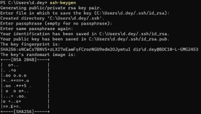
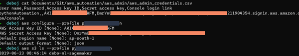

# Intro to accessing AWS and work with s3

The four concepts will be convering:
- Creating an IAM role  
- Different ways of Accessing: WSL and  Putty 
- Configuring local system
- Different ways of creating buckets

## Creating an IAM role

The step need to be followed:
1. Create a loging with gmail in aws console
2. We will use the free tier to create  
3. Once in Console
	- Search for IAM  
    - Create a IAM Group : awsIntro > AdminAccess  
    - Create two users: debo and sudhir  
    - download the csv

## Different ways of Accessing: *.msi and  Putty 
1. AWSCLI Installer in Windows - Debo
2. Putty - Sudhir

##  Configuring local system
1. Simple Installer : [AWSCLI](https://docs.aws.amazon.com/cli/latest/userguide/install-cliv2-windows.html#cliv2-windows-install)
2. Open command prompt:
    - check > aws --version
3. Create ssh-key:
    - sssh-keygen  
    
4. Configuring the AWS CLI:
    - cat /path/aws-credential.csv  
    - aws configure --profile aws-into
    The AWS configuration should look like:
    
5. Testing for the setup:
    - aws s3 ls --profile aws-intro

## Different ways of creating buckets

1. Console frontend
    - aws s3 mb s3://awsintodebo-command
2. Using boto:
    - import botot3  
    - session = boto3.Session(profile='aws-intro)
    - s3 = session.resource("s3")  
    - for buk in s3.buckets.all():
        print(buk)
3. Creating new bucket:
    - new_bucket =  botot3.create_bucket(Bucket="awsintodebo-boto3")  # will not work
4. One needs to specify region
    - new_bucket =  botot3.create_bucket(Bucket="awsintodebo-boto3", CreateBucketConfiguration={'LocationConstraint':'ap-south-1'})  #will work

